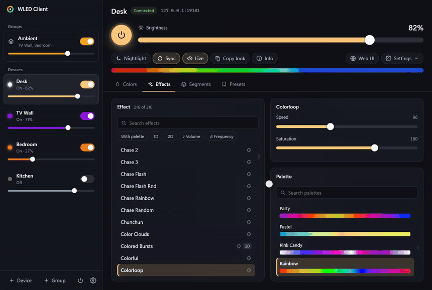
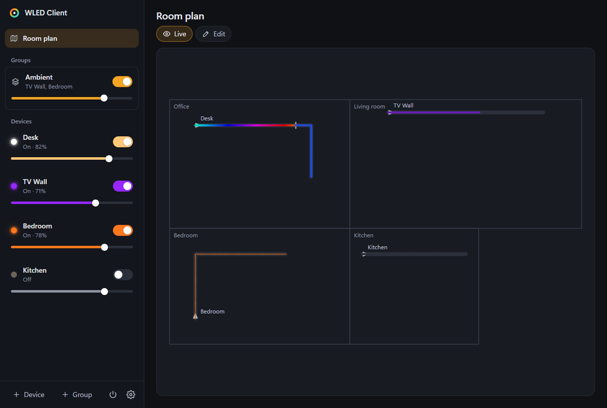

<div align="center">


# WLED Client

**All your [WLED](https://kno.wled.ge) lights in one fast Windows app — with tray quick-access, groups and links for
automations.**

[](https://github.com/bangboomben/wled-client/releases/latest)
[](LICENSE)


</div>

> **Unofficial** community project, not affiliated with WLED. It uses WLED's public JSON API.

## Features

- **All devices in one window** — on/off and brightness for each device in the sidebar; switch with a click or
  `Ctrl+1…9`
- **Tray quick-access** — on/off and brightness for every light and group, plus *All off*
- **Groups** — switch and dim several lights together; brightness scales proportionally. Click a group to set a
  color, effect, palette or look for all of its lights
- **Copy look** — effect, palette, colors and effect sliders from one light to other lights or groups
- **Room plan** — draw your rooms and place strips, bulbs and matrices where they hang; they glow live, and a click
  switches, dims or sets an effect
- **[Links for automations](#links-for-automations)** — control lights from a Stream Deck, hotkeys or the Task
  Scheduler
- **Everything the web UI does** — colors (wheel, RGBW, CCT), all effects with their own sliders and options,
  palettes with previews, segments, presets and playlists, nightlight, UDP sync, live LED preview
- **Device settings and web UI** in their own window
- **Discovery** via mDNS and the WLED node list; devices on other subnets by IP or address-range scan
- **Light and dark theme**, **English and German**, **automatic updates**

<p align="center"></p>

<p align="center"></p>

| | |
|:---:|:---:|
|  |  |
|  |  |
|  |  |

## Install

1. Download **`WLED-Client-Setup-x.y.z.exe`** from the [latest release](https://github.com/bangboomben/wled-client/releases/latest)
   and run it — installs per user, no admin rights.
2. Until code signing is set up, SmartScreen warns about an unknown publisher: **More info → Run anyway**
   ([code signing policy](CODE_SIGNING.md)).

- On first start the app adds the WLED devices it finds. Others: **+ Device** → IP address or *Scan an address range*.
- Closing the window keeps the app in the tray; quit via right-click on the tray icon. Windows 11 hides new tray
  icons under ^ — drag it onto the taskbar.
- Updates download in the background and install on restart (from 1.2.0 on; can be turned off).
- Settings live in `%APPDATA%\WLED Client\`.

**Requirements:** Windows 10 or 11 (x64). Tested with WLED 16.0.1; 0.14 and 0.15 should work.

## Links for automations

Turn on *Allow links from other programs* in the app settings, then open `wled-client://<target>/<action>[/<value>]`
from any program. If the app isn't running, the link starts it in the tray.

**Targets:** `device/<name>`, `group/<name>`, `all` — names as in the app, case-insensitive, spaces as `%20`.

| Action | |
|---|---|
| `on` · `off` · `toggle` | switch |
| `brightness/50` · `brightness/+10` · `brightness/-10` | brightness in percent (1–100) or a step; switches on |
| `preset/<name or number>` | preset (single lights) |
| `color/ff8000` | solid color |
| `effect/<name>` · `palette/<name>` | effect or palette |
| `look-from/<light>` | look of another light |

- **Stream Deck:** *System › Website* with the link as URL; several links in a *Multi Action*
- **AutoHotkey v2:** `Run "wled-client://all/off"`
- **Task Scheduler:** program `%LOCALAPPDATA%\Programs\WLED Client\WLED Client.exe`, argument `wled-client://all/off`
  — e.g. on workstation lock

Errors show up as a Windows notification. For a Stream Deck key that shows a light's state, use a WLED Stream Deck
plugin.

## FAQ

**Does it change settings on my devices?** No — only what you do in the app, through the same API as the web UI.

**A device isn't found?** Discovery doesn't cross routers or VPNs. Add it by IP or scan its address range.

**Live preview stopped?** WLED streams it to one client at a time; "Peek" in the web UI takes it over.

**Internet or an account needed?** No, everything stays on your network.

## Alternatives

[Official WLED app](https://play.google.com/store/apps/details?id=ca.cgagnier.wlednativeandroid) (Android,
[iOS](https://apps.apple.com/us/app/wled-official-app/id6446207239)) ·
[WLED-Desktop](https://github.com/Moustachauve/WLED-Desktop) ·
[Home Assistant](https://www.home-assistant.io/integrations/wled/) · the device's own web UI

## Development

Node.js ≥ 22 (Python with Pillow only for `npm run icons`).

```bash
npm install
npm run dev                     # Vite + Electron with hot reload
npm run typecheck && npm test   # types and unit tests (Vitest)
npm run i18n                    # every UI text needs an English entry in src/shared/i18n-en.ts
npm run build && npm run e2e    # end-to-end test (Playwright) against simulated devices
npm run dist                    # Windows installer into release/
npm run mock                    # two simulated WLED devices on 127.0.0.1:8181 and :8182
npm run screenshots             # docs/screenshots/; npm run demo and demo:groups record the GIFs (ffmpeg)
```

Releases: push a tag `vX.Y.Z`. The [release workflow](.github/workflows/release.yml) builds, tests, signs (once
SignPath is set up) and publishes; notes come from `release-notes/<tag>.md`.

```
src/main/        main process: windows, tray, IPC, device connections, discovery, links
src/preload/     narrow bridge window.wled (contextIsolation, sandbox)
src/renderer/    React UI — main window and tray flyout
src/shared/      types, JSON-API patch logic, groups, look and link parsing
mock/fixtures/   recorded WLED 16.0.1 API responses for the simulator
```

## Kurz auf Deutsch

Windows-App für alle WLED-Lampen im Netz: Seitenleiste mit Ein/Aus und Helligkeit je Gerät, Tray-Schnellzugriff,
Gruppen mit Gruppenansicht, Look übertragen, Raumplan mit Live-Farben, Links für Stream Deck und Automationen —
dazu alles aus der WLED-Weboberfläche (Farben, Effekte, Paletten, Segmente, Presets, Playlists, Live-Vorschau).
Installer unter [Releases](https://github.com/bangboomben/wled-client/releases/latest), ohne Administratorrechte.
Oberfläche auf Deutsch und Englisch.

## Feedback

Bug reports and ideas: [discussions](https://github.com/bangboomben/wled-client/discussions) and
[issues](https://github.com/bangboomben/wled-client/issues).

## License & credits

[EUPL-1.2](LICENSE), the same license as WLED · [Privacy policy](PRIVACY.md) · [Code signing policy](CODE_SIGNING.md)

[WLED](https://github.com/wled/WLED) is created by Aircoookie and maintained by the WLED community. The test
fixtures in `mock/fixtures/` are recorded WLED API responses (effect names, palettes and effect metadata from the
WLED firmware, EUPL-1.2).
