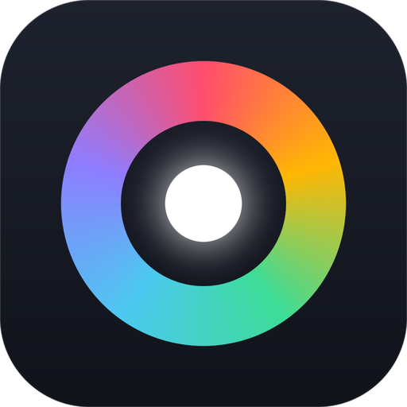
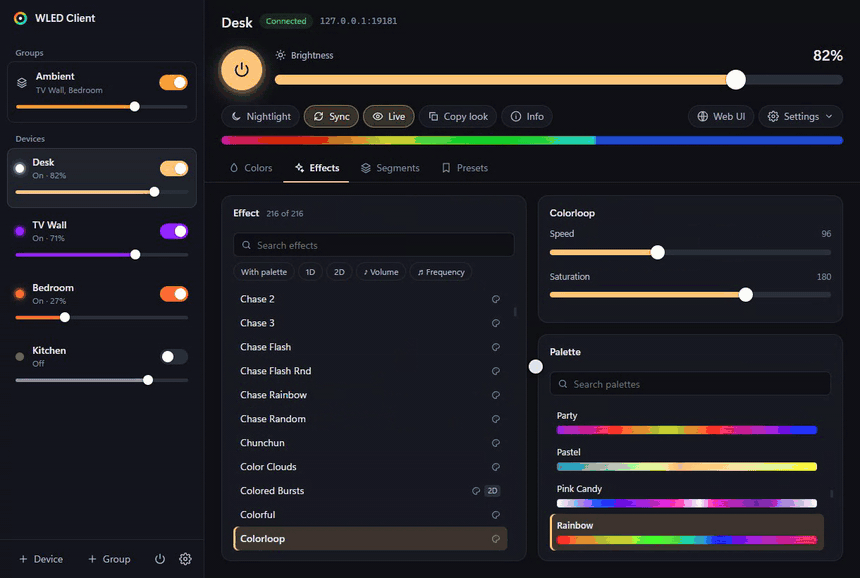
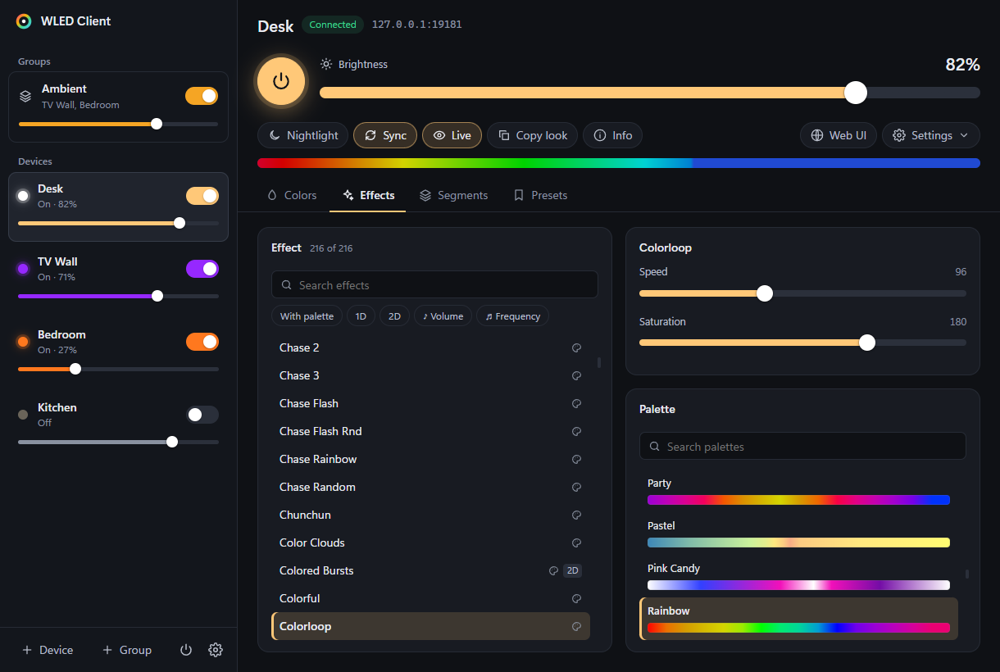
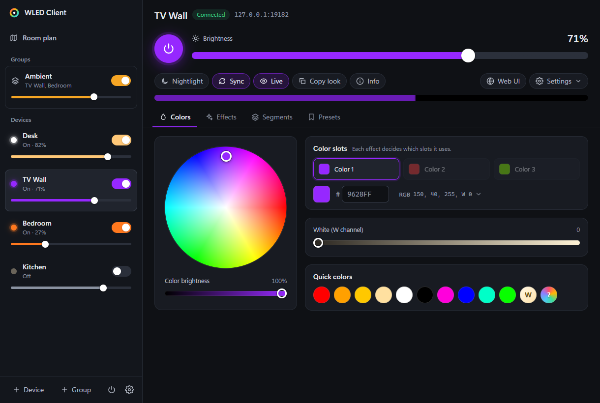
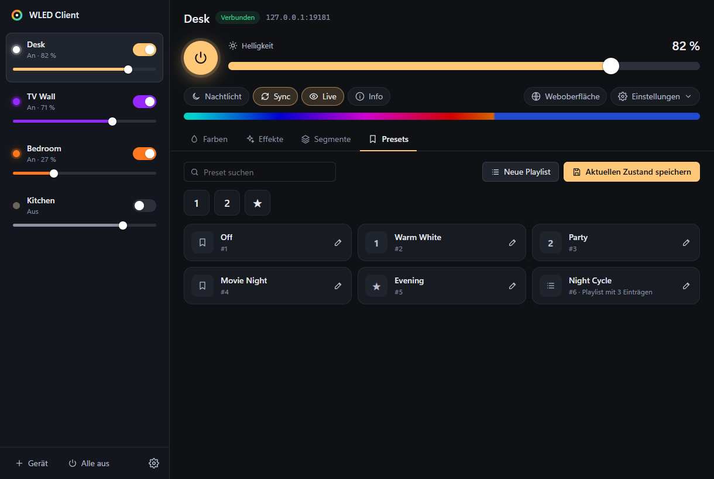
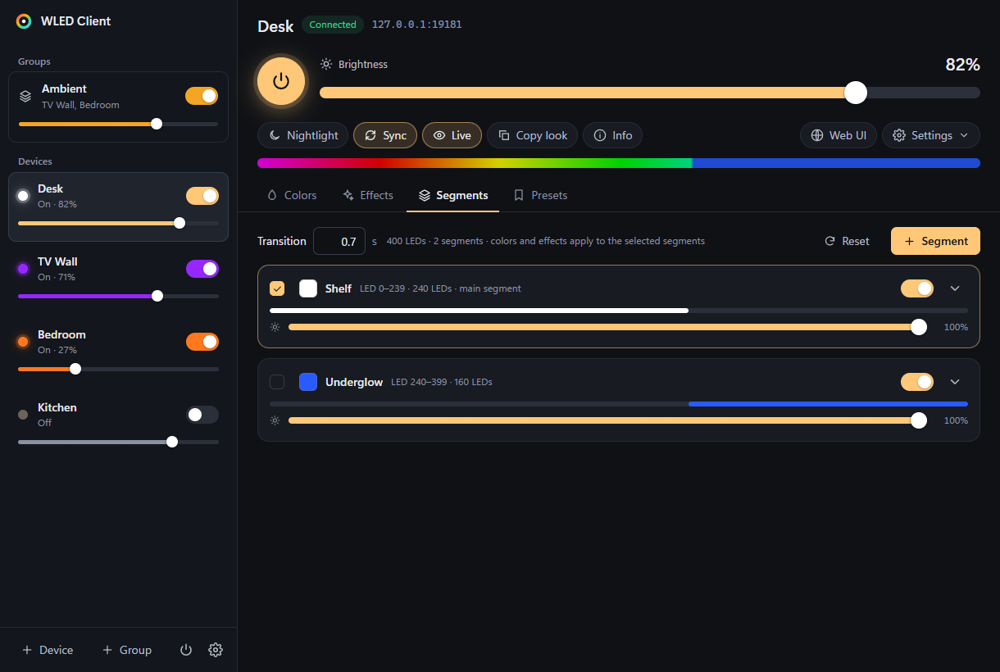
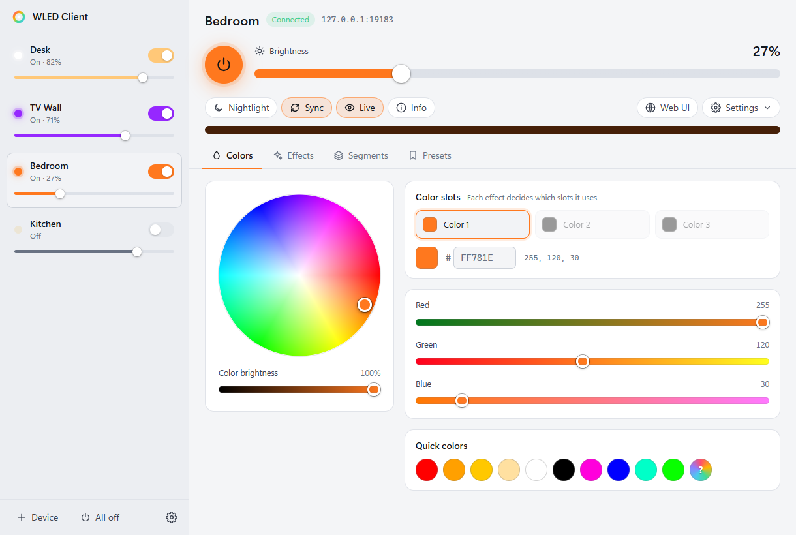
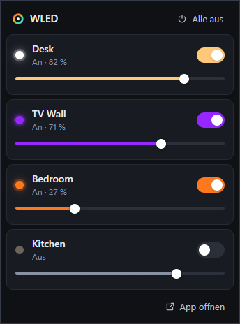

<div align="center">



# WLED Client

**A fast Windows desktop app for all your [WLED](https://kno.wled.ge) lights — in one window, with a tray quick-access.**

[](https://github.com/bangboomben/wled-client/releases/latest)
[](LICENSE)




</div>

The WLED web interface is great — for one device at a time. **WLED Client** keeps every controller on your
network in one place: switch between them with a click, dim any of them right from the sidebar, and reach
power and brightness of all lights from the Windows tray without opening anything.

> **Unofficial.** This is a community project and not affiliated with the WLED project.
> It talks to your controllers through WLED's public JSON API — nothing on the devices is modified.

## Features

- **All your devices, one window** — sidebar with power toggle and brightness slider per device, switch with a
  click or `Ctrl+1…9`
- **Tray quick-access** — click the tray icon: on/off and brightness for every light, plus *all off*
- **Everything the web UI does**
  - **Colors** — color wheel, three color slots, hex/RGB, white channel (RGBW), color temperature (CCT), quick colors
  - **Effects** — all effects with search and filters (palette, 1D, 2D, audio); sliders and options are labeled
    exactly as the firmware describes them for each effect
  - **Palettes** — every palette with a gradient preview, including custom palettes
  - **Segments** — create, delete, start/stop, grouping, spacing, offset, reverse, mirror, freeze, per-segment brightness
  - **Presets & playlists** — apply, save current state, raw API commands, quick-load labels, boot preset,
    playlists with per-entry duration and transition, repeat, end preset, shuffle
  - **Nightlight**, **UDP sync**, **live LED preview**, **device info**, reboot
- **Device settings pages** (Wi-Fi, LED setup, sync, time, usermods, OTA update …) open in their own window
- **Network discovery** — finds WLED devices on your subnet automatically; devices on other subnets
  (VPN, second site) can be added by IP or by scanning their subnet
- **Instant feedback** — live state over WebSocket; dragging a slider only ever sends the latest value
- **Gentle on weak Wi-Fi** — one request per device at a time, small requests first, missing data retried later
- **Light and dark theme**, follows Windows by default
- **English and German** interface, follows your Windows language
- **Updates itself** — new versions download in the background and install on the next restart

| | |
|---|---|
|  |  |
|  |  |
|  | |

<p align="center"><br/><em>Tray quick-access: on/off and brightness for every light</em></p>

> **Languages:** English and German — picked automatically from your Windows language, switchable in the app settings.

## Download & install

1. Download **`WLED-Client-Setup-x.y.z.exe`** from the [latest release](https://github.com/bangboomben/wled-client/releases/latest).
2. Run it. It installs per user — no admin rights needed — and adds Start menu and desktop shortcuts.
3. The installer is not code-signed yet, so Windows SmartScreen may warn about an unknown publisher:
   click **More info → Run anyway**.

On first start the app scans your local network (/24) and adds every WLED device it finds.
Devices on other subnets: **+ Gerät** (add device) → enter the IP, or add the subnet to the scan (e.g. `192.168.2.0/24`).

Windows 11 puts new tray icons into the overflow menu (^) — drag the icon onto the taskbar to keep the
quick-access one click away. Closing the window keeps the app running in the tray (configurable);
quit via right-click on the tray icon.

**Updates:** from version 1.2.0 on, the app checks GitHub for new releases, downloads them in the background
and installs them when you restart (or right away via *Restart now*). Can be turned off in the app settings.
Coming from 1.0 or 1.1? Install 1.2.0 once by hand — after that it's automatic.

Settings and the device list live in `%APPDATA%\WLED Client\`.

## Requirements

- Windows 10 or 11 (x64)
- WLED controllers reachable from your PC — developed and tested against **WLED 16.0.1**. Recent 0.14/0.15
  releases speak the same JSON API and should work, but are untested so far — feedback welcome.

## FAQ

**Does it change anything on my devices?** Only what you do in the app — the same JSON API commands the web UI
sends. It never writes device configuration on its own.

**Why doesn't it find a device?** Discovery checks `/json/info` on every address of the subnet. Devices behind
a VPN or on another subnet must be added by IP. Controllers with very weak Wi-Fi may need a second scan.

**Live preview stopped?** WLED streams the live preview to one client at a time — opening "Peek" in the web UI
takes it over.

**Does it need internet or a cloud account?** No. Everything is local HTTP and WebSocket to your controllers.

## Development

Requires Node.js ≥ 22 (Python with Pillow only to regenerate icons).

```bash
npm install
npm run dev          # Vite with hot reload + Electron (restarts on main-process changes)
npm run typecheck
npm run i18n         # every UI text needs an English translation (src/shared/i18n-en.ts)
npm run build        # dist-electron/ (main, preload) + dist/renderer/ (UI)
npm run dist         # build + Windows installer into release/
```

### Architecture

```
src/main/        main process: windows, tray, IPC, device connections, discovery
  device.ts      one connection per device (WebSocket + HTTP, command queue, retries)
  devices.ts     device list (add, remove, reorder, persist)
  discovery.ts   network scan via /json/info and /json/nodes
src/preload/     narrow bridge window.wled (contextIsolation, sandbox)
src/renderer/    React UI — main window and tray flyout (flyout.html)
src/shared/      types and the JSON-API patch logic (merge.ts)
```

- The main process keeps **one** WebSocket per device for live state and commands (HTTP as fallback) and
  pushes updates to both windows via IPC.
- Commands with the same key replace each other in the queue — dragging a slider only sends the latest value.
- The UI applies every change immediately using the same patch semantics as the firmware (`src/shared/merge.ts`).

### Testing without real lights

`scripts/mock-wled.mjs` simulates WLED devices (HTTP API, WebSocket, presets, live preview) from recorded
WLED 16.0.1 API responses in `mock/fixtures/`.

```bash
npm run mock                     # two simulated devices on 127.0.0.1:8181 and :8182
npm run build && npm run e2e     # end-to-end test (Playwright) against simulated devices
node scripts/e2e.mjs --exe "release/win-unpacked/WLED Client.exe"   # same, against the packaged app
npm run screenshots              # regenerates docs/screenshots/
npm run demo                     # records docs/demo.gif + docs/demo.mp4 (needs ffmpeg)
```

## Kurz auf Deutsch

WLED Client ist eine Windows-App für alle WLED-Controller im Netz: Geräte per Klick oder `Strg+1…9` wechseln,
Helligkeit und Ein/Aus direkt in der Seitenleiste und im Tray-Schnellzugriff, dazu alles, was die
WLED-Weboberfläche kann (Farben, Effekte, Paletten, Segmente, Presets, Playlists, Nachtlicht, Sync,
Live-Vorschau). Installer unter [Releases](https://github.com/bangboomben/wled-client/releases/latest),
Installation ohne Administratorrechte. Die Oberfläche spricht Deutsch und Englisch, je nach Windows-Sprache.

## License & credits

Licensed under the [EUPL-1.2](LICENSE), the same license as WLED.

[WLED](https://github.com/wled/WLED) is created by Aircoookie and maintained by the WLED community — this client
just talks to it. The test fixtures in `mock/fixtures/` are recorded API responses of WLED (effect names,
palettes and effect metadata come from the WLED firmware, EUPL-1.2).
